# 📚 Documentation Deployment Workflow

This directory contains the GitHub Actions workflow for automatically deploying our Docusaurus documentation site to GitHub Pages.

## 🚀 Workflow Overview

Our deployment process consists of **4 sequential jobs** that ensure reliable, high-quality deployments:

```mermaid
graph LR
    A[🔍 Validate] --> B[🏗️ Build]
    B --> C[🚀 Deploy]
    C --> D[🧪 Verify]
```

### 1. 🔍 Validate & Test
- **Smart Change Detection**: Only runs if documentation files changed
- **Configuration Validation**: Checks Docusaurus config integrity
- **Dependency Verification**: Ensures all packages install correctly
- **Pre-flight Checks**: Validates environment before building

### 2. 🏗️ Build Documentation
- **Optimized Build Process**: Uses production-optimized settings
- **Build Validation**: Verifies all critical files are generated
- **Performance Monitoring**: Tracks build time and size
- **Asset Optimization**: Removes unnecessary files and optimizes output

### 3. 🚀 Deploy to GitHub Pages
- **Secure Deployment**: Uses minimal required permissions
- **Timeout Protection**: 10-minute deployment timeout
- **Environment Configuration**: Proper GitHub Pages environment setup
- **Deployment Summary**: Detailed report with URLs and metrics

### 4. 🧪 Verify Deployment
- **Accessibility Check**: Verifies site is live and accessible
- **Health Monitoring**: Basic connectivity and functionality tests
- **Deployment Report**: Creates comprehensive deployment summary

## 🎯 Triggering Deployments

### Automatic Deployment
The workflow automatically triggers when you:
- Push changes to the `main` branch
- **AND** modify any of these file types:
  - Documentation files (`new-docs/**`)
  - Static assets (`static/**`)
  - Source code (`src/**`)
  - Configuration files (`docusaurus.config.js`, `sidebars.js`)
  - Package dependencies (`package*.json`)

### Manual Deployment
You can manually trigger a deployment:
1. Go to **Actions** tab in GitHub
2. Select **"📚 Deploy Documentation to GitHub Pages"**
3. Click **"Run workflow"**
4. Optionally check **"Force deployment"** to bypass change detection

## 📊 Smart Features

### ⚡ Efficiency
- **Skip Unnecessary Builds**: Only deploys when documentation actually changes
- **Fast Caching**: Optimized npm dependency caching
- **Parallel Processing**: Multiple validation steps run concurrently
- **Build Optimization**: Removes source maps and debug files

### 🛡️ Reliability
- **Validation Gates**: Won't deploy if validation fails
- **Error Handling**: Clear error messages and failure reporting
- **Timeout Protection**: Prevents stuck deployments
- **Post-deployment Verification**: Ensures deployment actually worked

### 📈 Monitoring
- **Build Metrics**: Tracks build time, size, and file count
- **Deployment Reports**: GitHub-native summaries with all key info
- **Performance Tracking**: Historical build performance data
- **Status Indicators**: Clear success/failure indicators

## 📋 Workflow Status

After each deployment, you'll see a detailed summary including:
- 📍 **Website URL**
- 📦 **Build Size**
- ⏱️ **Build Time**
- 🔗 **Commit Hash**
- ✅ **Features Deployed**

## 🔧 What Gets Deployed

Every successful deployment includes:
- ✅ **Enhanced search** with compact pagination
- ✅ **Mobile-optimized** responsive design
- ✅ **Dark/light theme** support
- ✅ **WCAG 2.1 AA** accessibility compliance
- ✅ **Performance optimizations**
- ✅ **SEO enhancements**

## 🛠️ Maintenance

### When to Modify This Workflow
- Adding new validation steps
- Updating Node.js version
- Adding new deployment environments
- Modifying build optimizations

### File Paths to Monitor
- `new-docs/`: All documentation content
- `static/`: Images, CSS, JavaScript assets
- `docusaurus.config.js`: Site configuration
- `package.json`: Dependencies and scripts

### Troubleshooting
- **Build Failures**: Check the validation job logs
- **Deployment Issues**: Review the deploy job output
- **Site Not Loading**: Check the verify job results
- **Performance Issues**: Review build metrics in deployment summaries

---

**💡 Pro Tip**: The workflow is designed to be "set it and forget it" - just push your documentation changes to `main` and everything else happens automatically!
