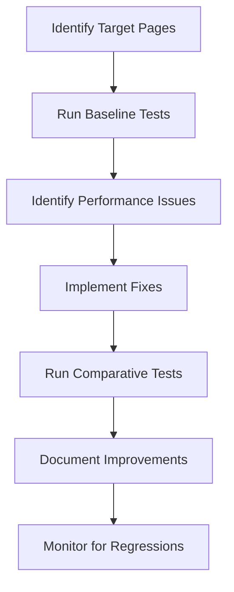

# Performance & Core Web Vitals Playbook

This guide provides strategies for monitoring and improving website performance with a focus on Core Web Vitals.

!!! info "Core Web Vitals Impact"
    Core Web Vitals are a set of specific factors that Google considers important for user experience, and they directly impact search rankings.

## Core Web Vitals Explained

=== "Largest Contentful Paint (LCP)"
    **What it measures**: Loading performance - how quickly the main content of a page loads.
    
    **Good score**: 2.5 seconds or faster
    
    **Key factors affecting LCP**:
    - Server response time
    - Render-blocking JavaScript and CSS
    - Resource load time
    - Client-side rendering

=== "First Input Delay (FID)"
    **What it measures**: Interactivity - how quickly the page responds to user interactions.
    
    **Good score**: 100 milliseconds or less
    
    **Key factors affecting FID**:
    - Heavy JavaScript execution
    - Long tasks (over 50ms)
    - Large JavaScript bundles
    - Third-party code impact

=== "Cumulative Layout Shift (CLS)"
    **What it measures**: Visual stability - how much the page layout shifts unexpectedly.
    
    **Good score**: 0.1 or less
    
    **Key factors affecting CLS**:
    - Images without dimensions
    - Ads, embeds, and iframes without dimensions
    - Dynamically injected content
    - Web fonts causing FOIT/FOUT

## Monitoring Performance

### Tools

1. **Google PageSpeed Insights**
   - Provides Core Web Vitals scores for both mobile and desktop
   - Offers actionable recommendations
   - Link: [PageSpeed Insights](https://pagespeed.web.dev/)

2. **Google Search Console**
   - Shows Core Web Vitals performance across your site
   - Identifies pages that need improvement
   - Groups similar issues together

3. **Lighthouse**
   - Built into Chrome DevTools
   - Run directly from your browser
   - Provides detailed performance audit

4. **Web Vitals Chrome Extension**
   - Real-time monitoring of Core Web Vitals
   - Link: [Web Vitals Extension](https://chrome.google.com/webstore/detail/web-vitals/ahfhijdlegdabablpippeagghigmibma)

### Monitoring Schedule

| Task | Frequency | Owner |
|------|-----------|-------|
| PageSpeed Insights check on key pages | Weekly | Brian |
| Search Console Core Web Vitals review | Monthly | Omar |
| Full Lighthouse audit | Quarterly | Brian |
| Performance regression testing | Before major releases | Jason/Brian |

## Improvement Strategies

### LCP Optimization

1. **Server Optimization**
   - Implement proper caching headers
   - Use a CDN for static assets
   - Optimize application code
   - Implement database query optimization

2. **Resource Optimization**
   - Compress and properly size images
   - Implement proper image formats (WebP, AVIF)
   - Use responsive images with srcset
   - Defer non-critical CSS and JavaScript

3. **Critical Rendering Path**
   - Inline critical CSS
   - Defer non-critical JavaScript
   - Preload important resources
   - Reduce third-party JavaScript impact

### FID Optimization

1. **JavaScript Optimization**
   - Break up long tasks
   - Use web workers for heavy operations
   - Implement code splitting
   - Defer or lazy-load non-critical JavaScript

2. **Third-Party Script Management**
   - Audit and reduce third-party scripts
   - Use async or defer attributes
   - Lazy-load third-party resources
   - Consider self-hosting critical third-party scripts

3. **Resource Prioritization**
   - Use `<link rel="preconnect">` for important third-party domains
   - Implement `<link rel="preload">` for critical assets
   - Use the Priority Hints API where appropriate

### CLS Optimization

1. **Image Handling**
   - Always specify width and height attributes
   - Use aspect ratio boxes
   - Implement proper image loading strategies

2. **Font Loading Optimization**
   - Preload web fonts
   - Use `font-display: swap` or `font-display: optional`
   - Consider system font fallbacks

3. **Layout Stability**
   - Reserve space for ads and embeds
   - Avoid inserting content above existing content
   - Implement content placeholders

## Implementation Guide

### Quick Wins

These changes typically have a high impact-to-effort ratio:

1. **Image Optimization**
   ```html
   
   ```

2. **Font Loading**
   ```html
   <link rel="preload" href="fonts/roboto.woff2" as="font" type="font/woff2" crossorigin>
   ```

3. **JavaScript Deferring**
   ```html
   <script src="non-critical.js" defer></script>
   ```

### Drupal-Specific Optimizations

1. **Advanced CSS/JS Aggregation**
   - Install and configure the Advanced CSS/JS Aggregation module
   - Enable CSS/JS minification and compression

2. **Image Styles & Responsive Images**
   - Configure appropriate image styles
   - Use responsive image styles with breakpoints

3. **BigPipe**
   - Enable the core BigPipe module
   - Implement placeholders for personalized content

4. **Caching Optimization**
   - Configure Drupal's internal page cache
   - Implement a reverse proxy cache (Varnish/Fastly)
   - Set up proper cache tags and contexts

## Performance Testing Process

Follow this workflow for comprehensive performance testing:



### Before Deployment

1. Run Lighthouse tests on staging environment
2. Compare results with production baseline
3. Ensure no performance regressions
4. Document test results in deployment ticket

## Handling Common Issues

!!! example "Slow Server Response Time"
    - **Problem**: Server takes too long to respond to requests, impacting LCP
    - **Solutions**:
      - Optimize application code
      - Implement proper caching
      - Consider server upgrades if necessary
      - Use a CDN for static assets

!!! example "Layout Shifts from Ads"
    - **Problem**: Advertisements cause layout shifts when they load
    - **Solutions**:
      - Reserve space for ad slots using fixed dimensions
      - Use CSS aspect ratio boxes
      - Implement sticky ads that don't push content

!!! example "Heavy JavaScript"
    - **Problem**: JavaScript execution blocks the main thread
    - **Solutions**:
      - Break up long tasks into smaller chunks
      - Use code splitting and lazy loading
      - Defer non-critical scripts
      - Consider using web workers for heavy computation

## References & Resources

- [Web Vitals](https://web.dev/vitals/)
- [Optimize LCP](https://web.dev/optimize-lcp/)
- [Optimize FID](https://web.dev/optimize-fid/)
- [Optimize CLS](https://web.dev/optimize-cls/)
- [Drupal Performance Documentation](https://www.drupal.org/docs/optimizing-site-performance)

**Key Contacts:** 
- Brian (Front-End & QA Lead) - Front-end performance
- Jason (Senior Backend Engineer) - Server-side performance 