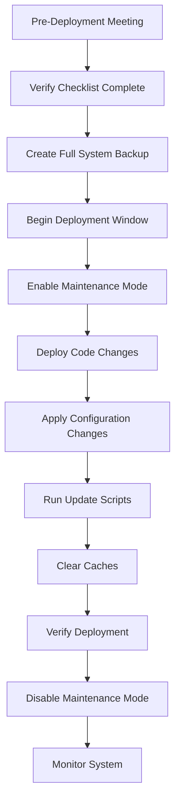
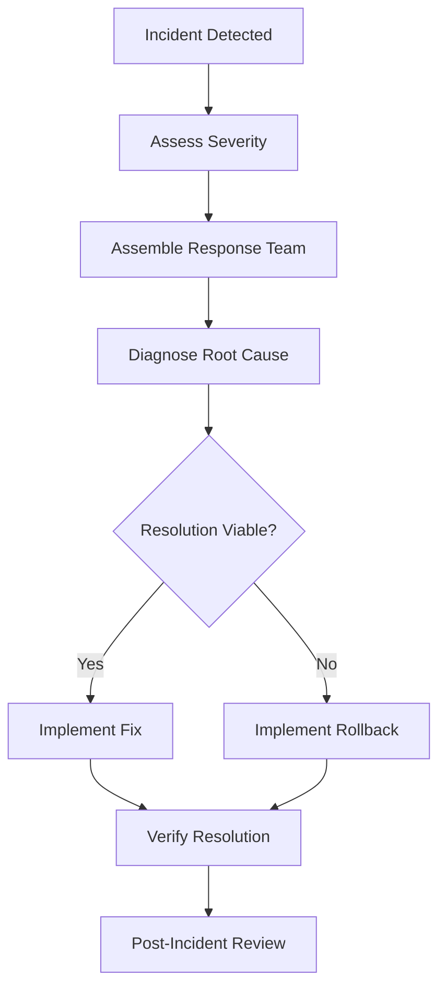

# Release Checklist & Incident Rollback Procedure

This guide provides a structured approach for planning releases and responding to incidents that require rollbacks.

!!! warning "Critical Procedures"
    These procedures are critical to maintaining site stability. Follow them precisely for all production changes.

## Release Planning

### Types of Releases

=== "Standard Release"
    - Scheduled on a regular cadence
    - Contains non-urgent feature updates and bug fixes
    - Follows complete QA and testing process
    - Deployed during scheduled maintenance windows
    - Requires approval from Thomas (DX Director)

=== "Hotfix"
    - Addresses critical bugs affecting user experience
    - Follows expedited but thorough QA
    - May be deployed outside scheduled windows
    - Requires approval from Thomas or Jason

=== "Emergency Fix"
    - Resolves security vulnerabilities or site-breaking issues
    - Minimal but focused QA focused on the specific issue
    - Can be deployed immediately when necessary
    - Requires post-implementation review

### Release Schedule

Standard maintenance windows:

| Day | Time | Purpose |
|-----|------|---------|
| Monday | 5:00-7:00 AM PT | Backend deployments |
| Wednesday | 5:00-7:00 AM PT | Frontend deployments |
| First Sunday of month | 11:00 PM-3:00 AM PT | Major system updates |

## Pre-Release Checklist

### 1. Planning & Documentation

- [ ] Release clearly defined in Asana with all included tasks
- [ ] Dependencies between tasks identified and ordered
- [ ] Release notes prepared with all changes documented
- [ ] Stakeholders notified of upcoming changes
- [ ] Deployment window confirmed

### 2. Code Review

- [ ] All code changes have been peer-reviewed
- [ ] Security review completed for sensitive changes
- [ ] Performance implications assessed
- [ ] Coding standards followed
- [ ] Documentation updated

### 3. Testing

- [ ] Unit tests pass
- [ ] Integration tests pass
- [ ] End-to-end tests pass
- [ ] Manual QA completed on staging
- [ ] Tested across required browsers/devices
- [ ] Accessibility testing completed
- [ ] SEO impact verified

### 4. Deployment Preparation

- [ ] Database backup scheduled
- [ ] Rollback plan documented
- [ ] Configuration changes documented
- [ ] Feature flags configured (if applicable)
- [ ] Load balancer strategy confirmed

### 5. Final Approval

- [ ] Final sign-off from Thomas
- [ ] QA sign-off from Brian
- [ ] Technical sign-off from Jason
- [ ] Communication plan approved
- [ ] Deployment team assigned and briefed

## Deployment Process



### Deployment Verification

1. **Smoke Tests**:
   - Verify key pages load correctly
   - Check critical user flows
   - Confirm functionality of primary actions
   - Verify search functionality
   - Test form submissions

2. **Monitoring**:
   - Check error logs for new issues
   - Monitor application performance
   - Verify database performance
   - Watch for unusual traffic patterns
   - Check third-party integrations

## Incident Response

### Severity Levels

=== "Severity 1 (Critical)"
    - Site completely down or unusable
    - Data breach in progress
    - Payment processing broken
    - Response time: **Immediate**
    - Notification: All stakeholders

=== "Severity 2 (High)"
    - Major functionality broken
    - Significant performance degradation
    - Unable to complete enrollment
    - Response time: **< 1 hour**
    - Notification: Technical team and management

=== "Severity 3 (Medium)"
    - Minor feature broken
    - Non-critical path affected
    - Cosmetic issues affecting experience
    - Response time: **Same business day**
    - Notification: Technical team

=== "Severity 4 (Low)"
    - Trivial bugs
    - Minor visual glitches
    - Non-critical improvements
    - Response time: **Next release**
    - Notification: Added to backlog

### Incident Detection

Incidents may be detected through:

- Automated monitoring alerts
- User reports
- Social media mentions
- Manual testing
- Support tickets

### Incident Response Workflow



## Rollback Procedures

### Decision Criteria

Consider rollback when:

- Critical functionality is broken
- Security vulnerability is exposed
- Data integrity is at risk
- The fix is complex or uncertain
- Resolution time exceeds acceptable downtime

### Drupal Rollback Process

1. **Codebase Rollback**:
   ```bash
   cd /var/www/uagc
   git checkout [previous-stable-tag]
   ```

2. **Database Rollback**:
   ```bash
   # Stop web services
   systemctl stop apache2
   
   # Restore database
   mysql -u [user] -p [database] < /path/to/backup/[backup-file].sql
   
   # Restart web services
   systemctl start apache2
   ```

3. **Configuration Rollback**:
   ```bash
   # Import previous configuration
   drush config:import --source=/path/to/config-backup
   ```

4. **Cache Clearing**:
   ```bash
   drush cache:rebuild
   ```

### Content Deployment Rollback

For content-only changes:

1. **Revert individual nodes**:
   ```bash
   drush entity:delete node [nid]
   ```

2. **Restore from revisions**:
   ```bash
   drush php:eval 'node_revision_revert([nid], [vid])'
   ```

## Post-Incident Analysis

After every major incident or rollback:

1. **Document the incident**:
   - Timeline of events
   - Systems affected
   - User impact
   - Resolution steps taken

2. **Conduct blameless post-mortem**:
   - What happened
   - Why it happened
   - How we detected it
   - How we resolved it
   - What we learned

3. **Create preventative actions**:
   - Process improvements
   - Monitoring enhancements
   - Testing improvements
   - Training needed

## Communication Templates

### Planned Maintenance Notice

```
SCHEDULED MAINTENANCE NOTICE

We will be performing scheduled maintenance on the UAGC website on 
[DATE] from [START TIME] to [END TIME] [TIMEZONE].

During this time, the website may be unavailable or experience intermittent issues.
We apologize for any inconvenience and appreciate your patience.

If you have any questions, please contact support@uagc.edu.
```

### Incident Communication

```
SYSTEM STATUS UPDATE

We are currently experiencing [BRIEF DESCRIPTION OF ISSUE] affecting [AFFECTED SYSTEMS].
Our team is actively working to resolve this issue.

IMPACT: [DESCRIBE USER IMPACT]
WORKAROUND: [IF AVAILABLE]
ESTIMATED RESOLUTION: [TIME IF KNOWN]

We will provide updates as more information becomes available.
```

## Emergency Contacts

| Role | Name | Primary Contact | Secondary Contact |
|------|------|-----------------|-------------------|
| DX Director | Thomas | thomas@uagc.edu | (555) 123-4567 |
| Senior Drupal Engineer | Jason | jason@uagc.edu | (555) 123-4568 |
| Frontend Lead | Brian | brian@uagc.edu | (555) 123-4569 |
| SEO & Tracking | Omar | omar@uagc.edu | (555) 123-4570 |
| Hosting Provider | Acquia | support@acquia.com | (555) 123-0000 |

**Key Contacts:** Jason (Deployments), Thomas (Approval) 