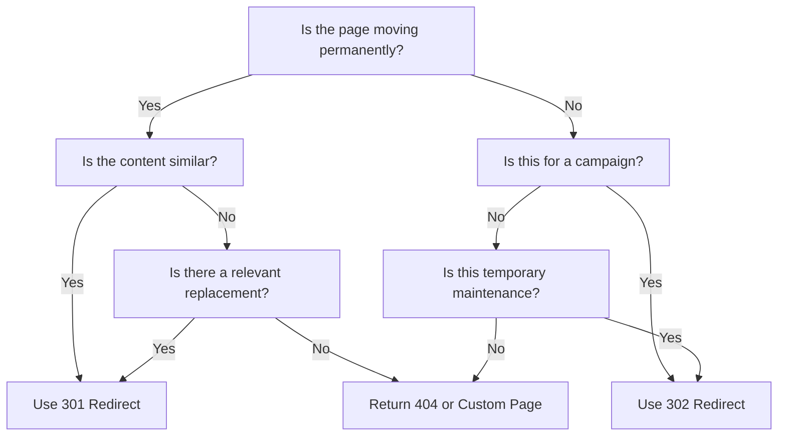

# SEO Redirect Decision Tree

This guide helps determine when and how to implement redirects to maintain SEO value and user experience.

!!! warning "Critical for SEO"
    Proper redirect implementation is critical for maintaining search rankings when URLs change. Always follow these guidelines for any URL modifications.

## When to Use Redirects

Redirects are necessary in the following situations:

1. **Page URL changes** - When a page's URL structure changes
2. **Content consolidation** - When merging multiple pages into one
3. **Site restructuring** - When reorganizing site architecture
4. **Domain changes** - When moving to a new domain
5. **Campaign tracking** - When creating vanity URLs for marketing

## Decision Tree

Use this decision tree to determine the appropriate redirect strategy:



## 301 vs. 302 vs. Canonical

=== "301 Permanent Redirect"
    - **When to use**: Content has permanently moved to a new URL
    - **SEO impact**: Passes ~90-99% of link equity to the new URL
    - **Browser behavior**: Browser caches the redirect
    - **Example scenario**: Changing URL structure, site migration

=== "302 Temporary Redirect"
    - **When to use**: Content is temporarily moved
    - **SEO impact**: No long-term link equity transfer
    - **Browser behavior**: Browser does not cache the redirect
    - **Example scenario**: A/B testing, temporary promotions, maintenance

=== "Canonical Tag"
    - **When to use**: Similar content exists at multiple URLs
    - **SEO impact**: Indicates preferred URL for indexing
    - **Browser behavior**: No effect on user experience
    - **Example scenario**: Product pages with filters, pagination, tracking parameters

## Implementation Guide

### 301 Redirect Implementation

1. **In Drupal**:
   - Use the Redirect module
   - Navigate to Configuration → Search and metadata → URL redirects
   - Add a new redirect with "Permanent (301)" status code

2. **In .htaccess** (Apache):
   ```apache
   Redirect 301 /old-path /new-path
   ```

3. **In Nginx**:
   ```nginx
   location /old-path {
     return 301 /new-path;
   }
   ```

### 302 Redirect Implementation

1. **In Drupal**:
   - Use the Redirect module
   - Set status code to "Found (302)"

2. **In .htaccess** (Apache):
   ```apache
   Redirect 302 /old-path /new-path
   ```

3. **In Nginx**:
   ```nginx
   location /old-path {
     return 302 /new-path;
   }
   ```

### Canonical Tag Implementation

```html
<link rel="canonical" href="https://www.uagc.edu/preferred-path" />
```

In Drupal, use the Metatag module to set canonical URLs for specific paths.

## Best Practices

1. **Redirect Chain Prevention**
   - Always redirect to the final destination URL
   - Regularly audit and fix redirect chains
   - Keep a record of all implemented redirects

2. **URL Structure Maintenance**
   - Preserve URL structure when possible
   - Plan URL changes carefully
   - Implement bulk redirects for pattern changes

3. **Monitoring & Verification**
   - Check Search Console for crawl errors
   - Verify redirects work properly after implementation
   - Monitor organic traffic to redirected pages

## Redirect Documentation

Document all redirects in the following format:

| Original URL | Destination URL | Redirect Type | Implementation Date | Reason |
|--------------|-----------------|---------------|---------------------|--------|
| /old-url | /new-url | 301 | YYYY-MM-DD | URL structure change |
| /promo | /campaign | 302 | YYYY-MM-DD | Temporary campaign |

## Common Issues & Solutions

!!! warning "Redirect Loops"
    A redirect loop occurs when page A redirects to page B, which redirects back to page A (or through a longer chain that eventually returns to the origin).
    
    **Solution**: Map out redirect paths before implementation and test thoroughly.

!!! warning "Redirect Chains"
    Multiple redirects in sequence slow down page load and dilute link equity.
    
    **Solution**: Always redirect to the final destination URL. Regularly audit and fix redirect chains.

!!! warning "404 After Redirect"
    Redirecting to a page that doesn't exist.
    
    **Solution**: Always verify destination URLs are valid before implementing redirects.

## Tools for Testing Redirects

- [Redirect Path](https://chrome.google.com/webstore/detail/redirect-path/aomidfkchockcldhbkggjokdkkebmdll) (Chrome extension)
- [Screaming Frog SEO Spider](https://www.screamingfrog.co.uk/seo-spider/)
- [Redirect Checker](https://redirectcheck.com/)

**Key Contact:** Omar (SEO & Tracking Manager) 