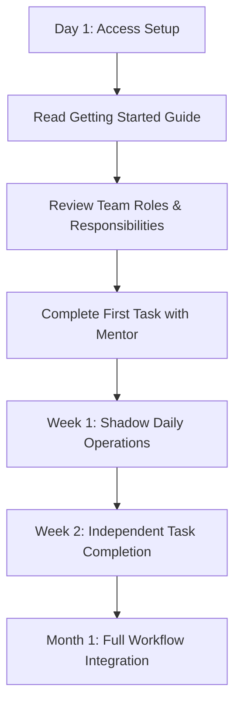

# Common Tasks

Quick access to the most frequently performed tasks, organized by role and urgency.

:::tip Quick Start
New to the team? Start with the **[Getting Started Guide](guides/getting-started.md)** then return here for daily task references.
:::

## 🚨 Urgent Tasks (< 30 minutes)

### Website Issues
| Task | Time | Guide | Owner |
|------|------|-------|-------|
| Site down/errors | 5-15 min | [Release & Incident](guides/release-incident.md) | Jason |
| Broken links/404s | 10-20 min | [SEO Redirects](guides/seo-redirects.md) | Omar |
| Form not working | 15-30 min | [RFI Form Guide](request-information-form.md) | Brian |
| Mobile issues | 20-30 min | [Performance Guide](guides/performance-web-vitals.md) | Brian |

### Analytics & Tracking Issues
| Task | Time | Guide | Owner |
|------|------|-------|-------|
| GA4 data missing | 10-20 min | [Analytics Standards](analytics-standards.md) | Omar |
| GTM tags not firing | 15-25 min | [GTM Configuration](gtm-configuration-datalayer.md) | Anthony |
| A/B test broken | 20-30 min | [Optimizely Tests](guides/optimizely-tests.md) | Anthony |

## 📅 Daily Operations (30-60 minutes)

### Content Management
- **Update page content**: [Page Changes Guide](guides/page-changes.md) → Create Asana task → Edit in Drupal → QA test
- **Fix SEO issues**: [SEO Hygiene](guides/seo-hygiene.md) → GSC analysis → Implement fixes → Monitor results  
- **Review site performance**: [Core Web Vitals](guides/performance-web-vitals.md) → PageSpeed audit → Optimize images → Test mobile

### Development Workflows
- **Code review process**: [Drupal Standards](guides/drupal-standards.md) → Review PR → Test locally → Approve/request changes
- **Release preparation**: [Release Procedures](guides/release-incident.md) → QA smoke test → Stakeholder approval → Deploy
- **Documentation updates**: [Documentation Workflow](documentation-workflow.md) → Draft content → Technical review → Publish

## 📊 Weekly Tasks (1-3 hours)

### Analytics & Reporting
| Task | Frequency | Process | Output |
|------|-----------|---------|--------|
| **GA4 Health Check** | Weekly | Review data quality, check for anomalies | Status report |
| **SEO Performance Review** | Weekly | GSC analysis, ranking changes | SEO dashboard update |
| **A/B Test Analysis** | Weekly | Review running tests, analyze results | Test recommendations |
| **Site Speed Audit** | Weekly | Core Web Vitals check, performance optimization | Performance report |

### Quality Assurance  
- **Comprehensive QA sweep**: [QA Smoke Test](guides/qa-smoke-test.md) → Test all major user flows → Document issues → Create fix tasks
- **Accessibility audit**: [Accessibility Guidelines](guides/accessibility.md) → Run automated tests → Manual review → Remediation plan
- **Content review**: [Content Standards](guides/content-standards.md) → Review recent changes → Check for consistency → Update as needed

## 🗓️ Monthly/Quarterly Tasks

### Strategic Reviews
- **Monthly**: Documentation review, process improvements, tool evaluations
- **Quarterly**: "Docs Day" comprehensive updates, strategic planning, team retrospectives

## 👤 Role-Based Quick Start

### New Team Member Onboarding


**Checklist**:
- [ ] Access to Asana, GitHub, Drupal admin
- [ ] Review [who-does-what.md](who-does-what.md) for role clarity  
- [ ] Complete [Digital Experience Funnel](digital-experience-enrollment-funnel.md) overview
- [ ] Shadow mentor for first 3 tasks
- [ ] Complete first independent task with review

### Developer Quick Reference

#### **Daily Checklist**
- [ ] Check [GitHub notifications](https://github.com/notifications) for PR reviews
- [ ] Review [Asana tasks](asana.md) for assigned work
- [ ] Run [QA smoke test](guides/qa-smoke-test.md) before any deployments
- [ ] Update documentation for any process changes

#### **Before Code Release**
1. **Code Quality**: Follow [Drupal Standards](guides/drupal-standards.md)
2. **Performance**: Check [Core Web Vitals](guides/performance-web-vitals.md) impact
3. **Accessibility**: Verify [WCAG compliance](wcag-compliance.md)
4. **Testing**: Complete [QA procedures](guides/qa-smoke-test.md)
5. **Documentation**: Update [Recent Updates](recent-updates.md) if significant

### Marketing/SEO Quick Reference

#### **Weekly SEO Tasks**
1. **Monday**: Review GSC for new issues, check [SEO Hygiene](guides/seo-hygiene.md)
2. **Wednesday**: Analyze [Analytics Standards](analytics-standards.md) performance 
3. **Friday**: Update [Strategic Intelligence](https://omac049.github.io/UAGC-Strategic-Intelligence/) reports

#### **Content Optimization Workflow**
```
Identify opportunity → Research keywords → Draft content → 
Internal review → Technical implementation → Performance monitoring
```

### Project Manager Quick Reference

#### **Task Management**
- **Daily**: Review [Asana workflow](asana.md) for task updates and blockers
- **Weekly**: Check project progress against [Growth Roadmap](growth-roadmap.md)
- **Monthly**: Facilitate [Documentation Workflow](documentation-workflow.md) reviews

#### **Communication Templates**
- **Status Updates**: Use structured format from [Content Standards](guides/content-standards.md)
- **Issue Escalation**: Follow [Release & Incident](guides/release-incident.md) procedures
- **Team Announcements**: Reference [Recent Updates](recent-updates.md) for context

## 🔍 Quick Search Guide

### Find Information Fast
| Looking For | Search Terms | Best Pages |
|-------------|-------------|------------|
| **How to fix...** | "fix", "troubleshooting", "error" | Guides section, Release procedures |
| **How to implement...** | "setup", "configuration", "implementation" | Analytics, GTM, Technical guides |
| **Process for...** | "workflow", "process", "steps" | Documentation workflow, Asana |
| **Who handles...** | "owner", "responsibility", "contact" | Who does what, Team profiles |

### Emergency Contacts
- **Site Down**: Jason (Backend) + Thomas (Approval)
- **Analytics Issues**: Omar (SEO/Analytics)  
- **Process Questions**: Brandy (Operations)
- **Content Issues**: Brian (Frontend/QA)

---

**Page Status**: ✅ Active | **Last Updated**: Auto-generated | **Next Review**: Quarterly Docs Day

:::info Need Help?
Can't find what you're looking for? Check the [Site Map](sitemap.md) or search the documentation using the search feature (press `/`).
::: 