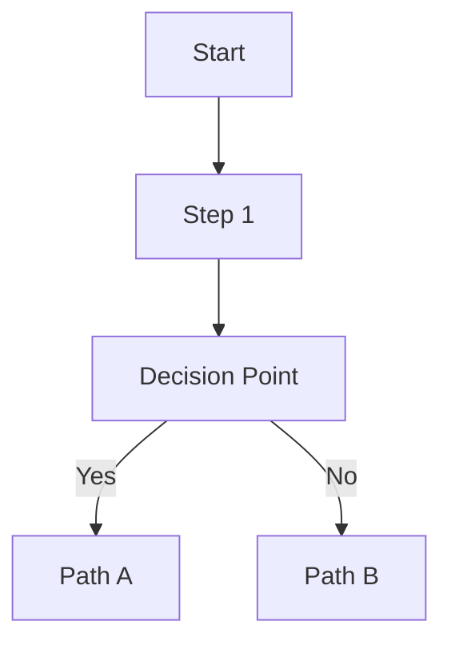

# Content Templates

This guide provides standardized templates for creating consistent, high-quality content across the UAGC website and documentation.

## Documentation Templates

### Technical Guide Template

Use this template for step-by-step technical documentation:

```markdown
# [Guide Title]

Brief description of what this guide covers and who should use it.

:::tip Prerequisites
List any required knowledge, access, or tools needed before starting.
:::

## Overview

- Purpose of this process
- Expected outcome
- Time estimate

## Step-by-Step Process

### Step 1: [Action]
Detailed instructions with specific commands or actions.

```bash
# Example commands if applicable
```

### Step 2: [Action]
Continue with clear, actionable steps.

## Troubleshooting

| Issue | Cause | Solution |
|-------|-------|----------|
| Common problem | Likely reason | How to fix |

## Related Resources

- [Link to related documentation]
- [External tools or references]
```

### Process Documentation Template

For workflow and procedure documentation:

```markdown
# [Process Name]

## Purpose
Explain why this process exists and its business value.

## Roles & Responsibilities

| Role | Responsibility |
|------|---------------|
| Team Member | What they do |

## Process Flow



## Detailed Steps

1. **Initial Action**: Clear description with who does what
2. **Review Phase**: Approval process and criteria
3. **Implementation**: Execution steps
4. **Validation**: How to verify success

## Quality Checklist

- [ ] Requirement met
- [ ] Documentation updated
- [ ] Stakeholders notified

## Success Metrics

How to measure if this process is working effectively.
```

### Content Page Template

For website content creation:

```markdown
# [Page Title]

## SEO Metadata
- **Target Keywords**: [primary, secondary, tertiary]
- **Meta Description**: [150-160 character description]
- **URL Structure**: /suggested-url-path

## Content Strategy
- **Audience**: [primary user persona]
- **Goal**: [conversion goal or user action]
- **Tone**: [professional, friendly, urgent, etc.]

## Content Structure

### Hero Section
- **Headline**: Clear, benefit-focused H1
- **Subheading**: Supporting detail
- **CTA**: Primary action button

### Body Content
- Problem statement
- Solution explanation  
- Benefits and features
- Social proof (testimonials, stats)
- Secondary CTAs

### SEO Elements
- H2/H3 structure with keywords
- Internal links to related content
- Image alt text descriptions
- Schema markup requirements

## Content Checklist
- [ ] Follows brand voice and tone
- [ ] Meets accessibility standards
- [ ] Includes required legal disclaimers
- [ ] Mobile-responsive design considered
- [ ] Load time optimized
```

### A/B Test Documentation Template

For experiment tracking:

```markdown
# [Test Name] - A/B Test

## Test Overview
- **Hypothesis**: What we believe will happen and why
- **Success Metric**: Primary KPI to measure
- **Test Duration**: Planned timeline
- **Traffic Split**: % allocation between variants

## Test Setup

### Variant A (Control)
- Description of current experience
- Screenshots if applicable

### Variant B (Treatment)  
- Description of new experience
- Key changes made
- Screenshots if applicable

## Implementation Details

### Optimizely Configuration
- Experiment ID: [ID]
- Audience targeting: [criteria]
- Goal setup: [conversion events]

### Technical Requirements
- [ ] DataLayer events configured
- [ ] Analytics tracking verified
- [ ] QA testing completed

## Results Analysis

### Performance Data
| Metric | Control | Treatment | Change | Significance |
|--------|---------|-----------|---------|--------------|
| Primary KPI | [value] | [value] | [%] | [p-value] |

### Insights & Recommendations
- Key findings from the test
- Recommended next steps
- Ideas for follow-up experiments
```

## Template Usage Guidelines

### When to Use Templates
- **New Documentation**: Start with appropriate template
- **Content Updates**: Ensure existing content follows template structure  
- **Consistency Checks**: Use templates to standardize existing content

### Customization Guidelines
- Adapt templates to specific content needs
- Maintain consistent structure elements
- Update templates based on user feedback

### Template Maintenance
- Review templates quarterly
- Update based on new requirements
- Archive outdated template versions

## Contributing to Templates

To suggest template improvements:

1. Create Asana task with "Template Enhancement" label
2. Provide specific use case and proposed changes
3. Include example of improved template usage
4. Tag content team for review

---

**Template Status**: ✅ Active  
**Last Updated**: Auto-generated  
**Next Review**: Quarterly Docs Day
