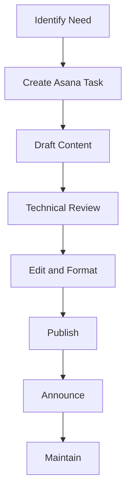

# Documentation Workflow

This page outlines the process for creating, publishing, and maintaining documentation in our DX documentation system using Docusaurus and automated build processes.

## Workflow

When adding or updating documentation:



### Step by Step Process

!!! info "1. Identify the need"
    Determine what documentation is missing or needs updating. Look for recurring questions, process changes, or new features.

!!! info "2. Create Asana task"
    Use the Documentation template to log the task. Include the documentation topic, priority, and due date.

!!! info "3. Draft content"
    Write the documentation following our style guidelines. Use the existing templates and structure.

!!! info "4. Technical review"
    Have relevant subject matter experts review for accuracy. Make sure all technical details are correct.

!!! info "5. Edit and format"
    Ensure the documentation follows our formatting standards. Apply Markdown formatting, add images if needed.

!!! info "6. Publish"
    Add the content to the `new-docs/` directory and publish using our Docusaurus build system:
    
    - Edit files in the `new-docs/` directory  
    - Test locally with `npm start`
    - Build and deploy with `npm run build && npm run deploy`
    - Automated search indexing with `npm run search-index`

!!! info "6.1. Update Recent Changes"
    For significant updates, add an entry to [Recent Updates](recent-updates.md) using:
    
    - Manual entry following the provided template and categorization system
    - Automated generation with `npm run updates` 
    - Timestamp validation with `npm run check-dates`

!!! info "7. Announce"
    Let the team know about the new/updated documentation via Slack in the #dx-team channel.

!!! info "8. Maintain"
    Schedule regular reviews to keep content fresh. Each section has a designated owner.

## Quality Guardrails

We maintain high-quality documentation through these standards:

=== "Clarity"
    Instructions should be clear and unambiguous. Use simple language and avoid jargon when possible. If technical terms are necessary, consider linking to definitions or providing explanations.

=== "Completeness"
    Cover all necessary steps and edge cases. Don't leave readers wondering "what if" or "what next." Include troubleshooting steps for common issues.

=== "Consistency"
    Follow established formatting and style guidelines. Use consistent terminology, capitalization, and structure across all documentation.

=== "Currency"
    Keep information up-to-date with current practices. Outdated documentation is often worse than no documentation at all. Schedule regular reviews.

=== "Conciseness"
    Be thorough but efficient with words. Focus on what readers need to know, not on everything that could be said about a topic.

## Quarterly "Docs Day"

To ensure our documentation remains relevant and accurate:

1. Block 2 hours every quarter for a team "Docs Day"
2. Each owner reviews their documentation sections
3. Update any outdated information
4. Remove or archive stale content
5. Identify gaps requiring new documentation

!!! tip "Docs Day Best Practices"
    - Schedule the event in advance and make it a priority
    - Use a checklist to track reviews and updates
    - Take notes on improvement ideas
    - Celebrate progress and improvements

The goal is to maintain living documentation that grows and evolves with our processes.

## Technical Setup

Our documentation system is built on:

### Core Technology
- **Docusaurus 3.8.1**: Static site generator for documentation
- **GitHub Pages**: Automated deployment to `omac049.github.io/uagc-dx-documentation/`
- **Algolia Search**: Full-text search integration with automated indexing

### File Structure
```
/new-docs/              # Source markdown files
  ├── guides/           # Technical guides and procedures
  ├── programs/         # Program-specific SEO documentation  
  └── *.md             # Main documentation pages

/src/                  # React components and styling
/static/              # Static assets (images, data files)
/build/               # Generated static site (auto-generated)
```

### Automation Scripts
- `npm start` - Local development server
- `npm run build` - Build static site for production  
- `npm run deploy` - Deploy to GitHub Pages
- `npm run updates` - Generate recent updates entries
- `npm run search-index` - Update Algolia search index
- `npm run docs-health` - Validate timestamps and generate updates

### Navigation Structure
Documentation is organized into main sections via `sidebars.js`:
- **Getting Started**: Onboarding and basic processes
- **QA & Development**: Technical standards and procedures  
- **Analytics & Tracking**: GA4, GTM, and data implementation
- **SEO Guide**: Search optimization strategies
- **Web Guidelines**: Accessibility, content, and UI/UX standards
- **References & Tools**: Utilities, glossaries, and workflows
- **Program SEO**: Program-specific optimization strategies

## Documentation Ownership

| Section | Owner | Review Frequency | Last Updated |
|---------|-------|------------------|--------------|
| **Getting Started** ||||
| Digital Experience Funnel | Team Lead | Quarterly | Sep 2025 |
| Day-to-Day Ops | Thomas | Quarterly | Aug 2025 |
| Common Tasks | All | Quarterly | Sep 2025 |
| **QA & Development** ||||
| Drupal Standards | Dev Team | Quarterly | Jul 2025 |
| QA Processes & Smoke Tests | QA Team | Quarterly | Aug 2025 |
| Performance & Web Vitals | Dev Team | Quarterly | Aug 2025 |
| **Analytics & Tracking** ||||
| GA4 & GTM Implementation | Analytics Team | Quarterly | Sep 2025 |
| Lead API & Salesforce | Anthony/Omar | Quarterly | Sep 2025 |
| Privacy & Consent | Legal/Compliance | Quarterly | Aug 2025 |
| **SEO & Content** ||||
| SEO Optimization | SEO Team | Quarterly | Aug 2025 |
| Content Standards | Content Team | Quarterly | Jul 2025 |
| Program SEO Strategies | SEO Team | Quarterly | Jul 2025 |
| **References & Tools** ||||
| Asana Workflows | Brandy | Quarterly | Jul 2025 |
| Request Information Form | Anthony/Omar | Quarterly | Sep 2025 |
| Documentation Workflow | All | Quarterly | Sep 2025 |
| **Technical Infrastructure** ||||
| Docusaurus Configuration | Dev Team | Quarterly | Jul 2025 |
| Automation Scripts | Dev Team | Monthly | Sep 2025 |
| Search & Algolia | Dev Team | Quarterly | Aug 2025 |

!!! warning "Ownership Responsibilities"
    As an owner, you are responsible for:
    
    - Accuracy of content
    - Timely updates when processes change
    - Adding significant changes to [Recent Updates](recent-updates.md)
    - Quarterly review completion
    - Responding to feedback about your section
    - Testing changes locally before publishing
    - Coordinating with automation scripts for updates 

## Troubleshooting Common Issues

### Build Errors
- **Node Version**: Ensure Node.js ≥18.0 (`node --version`)
- **Dependencies**: Clear and reinstall with `rm -rf node_modules package-lock.json && npm install`
- **Port Conflicts**: If port 3000 is busy, use `npm start -- --port 3001`
- **Memory Issues**: Increase Node memory with `NODE_OPTIONS="--max-old-space-size=4096" npm run build`

### Content Issues  
- **Broken Links**: Check internal links use `.md` extension and relative paths
- **Images Not Loading**: Verify images are in `static/img/` and referenced with `/img/` prefix
- **Formatting Problems**: Validate Markdown syntax and Docusaurus admonition format
- **Search Not Working**: Run `npm run search-index` to update Algolia

### Deployment Issues
- **GitHub Pages**: Verify deployment branch is set to `gh-pages` in repository settings
- **Path Issues**: Ensure `baseUrl` in `docusaurus.config.js` matches GitHub Pages path
- **Cache Problems**: Clear browser cache and try hard refresh (Ctrl+Shift+R)

### Getting Help
1. **Check Recent Updates**: Review [Recent Updates](recent-updates.md) for known issues
2. **GitHub Issues**: Search existing issues in the repository
3. **Team Slack**: Ask in #dx-team channel for quick help
4. **Documentation**: Refer to [Docusaurus documentation](https://docusaurus.io/docs) for technical issues

### Emergency Procedures
- **Broken Site**: Revert to last working commit and redeploy
- **Critical Content Error**: Use GitHub web editor for quick fixes
- **Search Down**: Algolia issues don't break the site - search will be temporarily unavailable
- **Automation Failing**: Manual processes can always be used as backup 