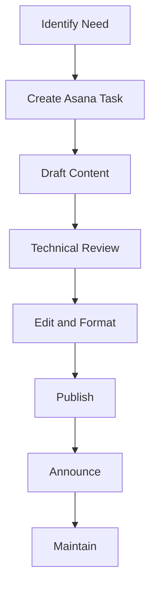

# Documentation Workflow

This page outlines the process for creating, publishing, and maintaining documentation in our DX documentation system.

## Workflow

When adding or updating documentation:

### Step by Step Process

!!! info "1. Identify the need"
    Determine what documentation is missing or needs updating. Look for recurring questions, process changes, or new features.

!!! info "2. Create Asana task"
    Use the Documentation template to log the task. Include the documentation topic, priority, and due date.

!!! info "3. Draft content"
    Write the documentation following our style guidelines. Use the existing templates and structure.

!!! info "4. Technical review"
    Have relevant subject matter experts review for accuracy. Make sure all technical details are correct.

!!! info "5. Edit and format"
    Ensure the documentation follows our formatting standards. Apply Markdown formatting, add images if needed.

!!! info "6. Publish"
    Add the content to the documentation platform using our GitHub-based workflow.

!!! info "6.1. Update Recent Changes"
    For significant updates, add an entry to [Recent Updates](recent-updates.md) using the provided template and categorization system.

!!! info "7. Announce"
    Let the team know about the new/updated documentation via Slack in the #dx-team channel.

!!! info "8. Maintain"
    Schedule regular reviews to keep content fresh. Each section has a designated owner.

## Quality Guardrails

We maintain high-quality documentation through these standards:

=== "Clarity"
    Instructions should be clear and unambiguous. Use simple language and avoid jargon when possible. If technical terms are necessary, consider linking to definitions or providing explanations.

=== "Completeness"
    Cover all necessary steps and edge cases. Don't leave readers wondering "what if" or "what next." Include troubleshooting steps for common issues.

=== "Consistency"
    Follow established formatting and style guidelines. Use consistent terminology, capitalization, and structure across all documentation.

=== "Currency"
    Keep information up-to-date with current practices. Outdated documentation is often worse than no documentation at all. Schedule regular reviews.

=== "Conciseness"
    Be thorough but efficient with words. Focus on what readers need to know, not on everything that could be said about a topic.

## Quarterly "Docs Day"

To ensure our documentation remains relevant and accurate:

1. Block 2 hours every quarter for a team "Docs Day"
2. Each owner reviews their documentation sections
3. Update any outdated information
4. Remove or archive stale content
5. Identify gaps requiring new documentation

!!! tip "Docs Day Best Practices"
    - Schedule the event in advance and make it a priority
    - Use a checklist to track reviews and updates
    - Take notes on improvement ideas
    - Celebrate progress and improvements

The goal is to maintain living documentation that grows and evolves with our processes.

## Documentation Ownership

| Section | Owner | Review Frequency |
|---------|-------|------------------|
| Asana | Brandy | Quarterly |
| Request Information Form | Anthony/Omar | Quarterly |
| Day-to-Day Ops | Thomas | Quarterly |
| Documentation Guides | All | Quarterly |

!!! warning "Ownership Responsibilities"
    As an owner, you are responsible for:
    
    - Accuracy of content
    - Timely updates when processes change
    - Adding significant changes to [Recent Updates](recent-updates.md)
    - Quarterly review completion
    - Responding to feedback about your section 