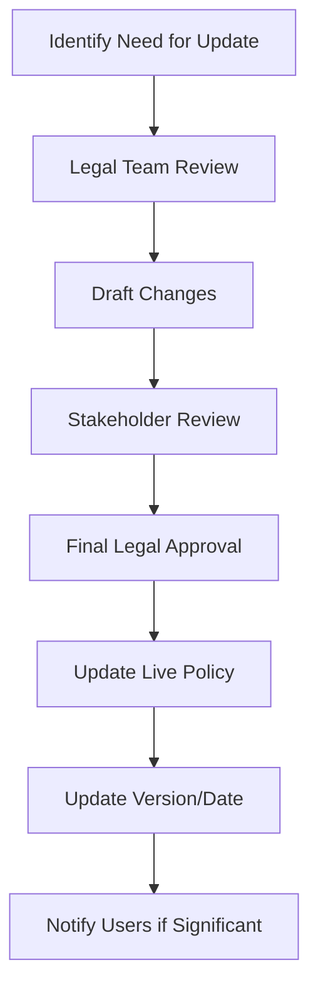

# Privacy, Consent & Cookie Governance

This guide outlines our approach to user privacy, consent management, and cookie usage in compliance with global privacy regulations.

!!! warning "Legal Compliance"
    Proper privacy practices and consent management are legal requirements in many jurisdictions. Always follow these guidelines to ensure compliance.

## Privacy Regulations Overview

**GDPR (EU)**
- **Key requirements**: Explicit consent, right to access/delete data, data breach notification
- **Territorial scope**: Applies to EU users regardless of company location
- **Penalties**: Up to €20 million or 4% of global revenue
- **Cookie implications**: Requires explicit consent for non-essential cookies

**CCPA/CPRA (California)**
- **Key requirements**: Right to know, delete, opt-out of data sales
- **Territorial scope**: Applies to businesses serving California residents
- **Penalties**: $2,500-$7,500 per violation
- **Cookie implications**: Must allow opt-out of "sale" of personal information

**PIPEDA (Canada)**
- **Key requirements**: Consent for collection/use/disclosure, right to access/correct data
- **Territorial scope**: Applies to organizations collecting data in Canada
- **Cookie implications**: Requires meaningful consent for tracking

## Consent Management System

We use a consent management platform (CMP) to capture and store user privacy preferences:

1. **Initial presentation**: Cookie banner presented on first visit
2. **Consent capture**: User selection recorded and stored
3. **Preference center**: Accessible via "Privacy Settings" link in footer
4. **Consent renewal**: Prompted after 6 months or when privacy policy changes

### Banner Configuration

Our cookie consent banner includes:

- Clear explanation of cookie usage
- Granular consent options (categories)
- Accept/Reject all buttons
- Link to privacy policy
- Link to detailed cookie settings

### Implementation

```html
<!-- Cookie consent banner implementation -->
<script>
  window.cookieConsentConfig = {
    categories: [
      { id: 'necessary', label: 'Necessary', isRequired: true },
      { id: 'functional', label: 'Functional' },
      { id: 'analytics', label: 'Analytics' },
      { id: 'marketing', label: 'Marketing' }
    ],
    consentExpiry: 180, // days
    onConsentCapture: function(consent) {
      // Set data layer variables for GTM
      window.dataLayer = window.dataLayer || [];
      window.dataLayer.push({
        'event': 'cookieConsentUpdate',
        'cookieConsent': consent
      });
    }
  };
</script>
<script src="/path/to/consent-manager.js" async></script>
```

## Cookie Categorization

All cookies must be categorized and documented:

**Necessary Cookies**
- **Description**: Essential for site functionality
- **Consent required**: No (always set)
- **Examples**: Session cookies, CSRF tokens, authentication
- **Retention**: Session or short-term (typically less than 30 days)

**Functional Cookies**
- **Description**: Enhance user experience but not essential
- **Consent required**: Yes
- **Examples**: Language preference, form pre-fill, user preferences
    - **Retention**: Up to 1 year

**Analytics Cookies**
- **Description**: Measure site usage and performance
- **Consent required**: Yes
- **Examples**: Google Analytics, Hotjar, internal analytics
- **Retention**: Varies (typically 1-2 years)

**Marketing Cookies**
- **Description**: Used for advertising and personalization
- **Consent required**: Yes
- **Examples**: Ad tracking, remarketing pixels, A/B testing
- **Retention**: Varies by vendor (typically 1-2 years)

## Cookie Inventory Management

Maintain a complete inventory of all cookies in the following format:

| Cookie Name | Category | Purpose | Provider | Duration | Personal Data | Last Updated |
|-------------|----------|---------|----------|----------|---------------|--------------|
| JSESSIONID | Necessary | Session management | UAGC | Session | No | 2023-03-15 |
| _ga | Analytics | User distinction | Google Analytics | 2 years | Yes (pseudonymous) | 2023-03-15 |

### Regular Audit Process

1. Scan website for cookies quarterly (using Cookie Scanner tool)
2. Update cookie inventory documentation
3. Ensure all cookies have proper categorization
4. Verify technical implementation respects consent

## Technical Implementation

### Google Tag Manager Setup

Our GTM implementation respects consent settings:

1. **Variable setup**:
   - Create cookie consent variables for each category
   - Use Data Layer variables to read consent status

2. **Trigger configuration**:
   - Create triggers that check consent status
   - Use these triggers for all tags requiring consent

3. **Tag management**:
   - Group tags by consent category
   - Set appropriate consent checks before firing

### Code Example

```javascript
// Example GTM tag firing logic
function canLoadTag(category) {
  return (
    dataLayer.find(item => 
      item.cookieConsent && 
      item.cookieConsent[category] === true
    ) !== undefined
  );
}

// Only load analytics if consent given
if (canLoadTag('analytics')) {
  // Load analytics code
}
```

## Privacy Policy Management

Our privacy policy must be:

1. **Comprehensive**: Cover all data collection, processing, sharing
2. **Accessible**: Easy to find, read, and understand
3. **Current**: Updated when practices change
4. **Accurate**: Reflect actual practices

### Update Workflow



## Data Subject Rights Handling

Process for handling user data requests:

1. **Request intake**: Form on website or email to privacy@uagc.edu
2. **Identity verification**: Confirm requestor's identity
3. **Request processing**: Gather requested information
4. **Response**: Deliver within required timeframe (30 days for GDPR)
5. **Documentation**: Record all requests and responses

### Request Types

- **Access**: Provide copy of all personal data
- **Deletion**: Remove user's personal data
- **Correction**: Update inaccurate data
- **Portability**: Provide data in machine-readable format
- **Restriction**: Limit processing of user's data
- **Objection**: Stop processing based on legitimate interests

## Vendor Management

For third-party services processing personal data:

1. **Assessment**: Evaluate privacy practices before implementation
2. **Data Processing Agreement**: Execute with all data processors
3. **Consent check**: Ensure vendors respect user consent choices
4. **Regular audit**: Review vendor compliance annually

## Training & Compliance

All team members involved with the website must:

1. Complete privacy training annually
2. Understand which features require consent
3. Know how to handle data subject requests
4. Report potential privacy issues immediately

## Resources

- [GDPR Official Text](https://gdpr-info.eu/)
- [CCPA Information](https://oag.ca.gov/privacy/ccpa)
- [Cookie Scanner Tool](https://cookiescanner.example.com)
- [UAGC Privacy Policy](https://www.uagc.edu/privacy)

**Key Contacts:**
- Omar (SEO & Tracking Manager) - Consent implementation
- Legal Department - Policy questions & data requests 